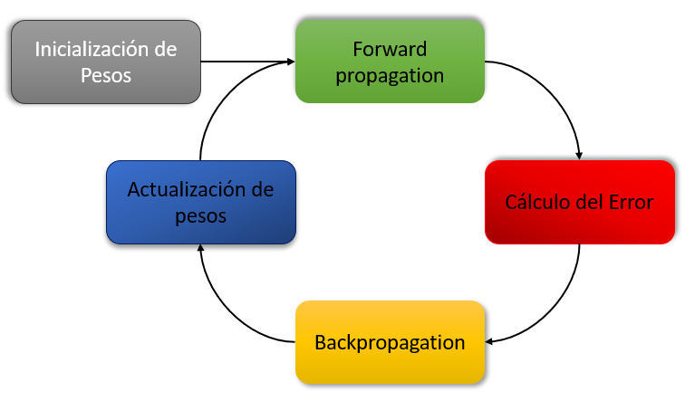

## ¿Qué son las redes neuronales?
Rodolfo Armando Jaramillo Ruiz - 31 de Mayo de 2023

> A neural network is a massively parallel distributed processor made up of simple processing units, which has a natural propensity for storing experiential knowledge and making it available for use. It resembles the brain in two respects:
>
> 1. Knowledge is acquired by the network from its environment through a learning process.
> 2. Interneuron connection strengths, known as synaptic weights, are used to store the acquired knowledge.
>
> — Haykin, S. (1999). Neural Network a Comprehensive Foundation (p. 2).

Esta es la definición de lo que es una red neuronal desde la perspectiva computacional. En síntesis, una red neuronal es un conjunto de operadores sencillos que trabajan en conjunto para almacenar conocimiento obtenido de su interacción con el entorno.

La idea del cómputo a través de modelos como el descrito anteriormente es tener un sistema capaz de aprender a través de *inputs* ambientales, adaptarse y resolver problemas de manera más flexible.

### Neurona Artificial

El modelo de una neurona artificial es el siguiente:

Leido de izquierda a derecha, se puede ver que los *inputs signals* entran a traves de lo que me he referido anteriormente como nodos de origen. El valor que entra por estos nodos es multiplicados por un factor que se llama *Synaptic weights* o pesos sinápticos. Estos productos entran a un nodo referido como *Summing junction*. Además se agrega el *bias* o sesgo. La suma, entonces, es la siguiente:
$$
v_k = \sum_{j=1}^{m} w_{kj}x_{j}+b_{k}
$$
Esta expresion nos dice que si tenemos $m$ nodos origen por donde los datos entran, estos nueve son multiplicados por sus pesos respectivos, se suman todos estos, lo que es una suma ponderada, y se agrega el *bias* como $b_{k}$ para obtener el valor $v_{k}$ de una neurona $k$.

Luego, tenemos que pasar este valor $v_{k}$ por la función de activación. Lo que hace esta función es determinar si la neurona debe activarse o no. Existen de muchos tipos, una función de activación seria la función sigmoide
$$
\phi(v_{k})=\frac{1}{1+e^{-av_{k}}}
$$

Pero existen otros tipos de funciones de activación.

El *output* de la neurona sería entonces $$y_{k}=\phi(v_{k})$$

### Ejemplos de usos y arquitecturas

Se enumeran ejemplos del uso de Redes Neuronales en nuestra interacción con la tecnología:

1. En redes sociales se usa para analizar el comportamiento del usuario y presentarle contenido que lo retenga dentro de la aplicacion lo más posible. A consideración personal, TikTok es uno de los grandes exponentes de un, coloquialmente llamado, "algoritmo de recomendación" poderoso.
2. La existencia de camaras de seguridad que sean capaz de indentificar a personas buscadas es gracias al reconocimiento de imagenes hecho a través de redes neuronales.
3. Dentro de los videojuegos se trabaja con agentes inteligentes entrenados usando redes neuronales.

En general se pueden, se puede pensar en tres arquitecturas de redes neuronales para que son fundamentalmente diferentes (Haykin, 1999):
1. Redes Neuronales de una sola capa o Single-Layer: Consta solamente de una capa de *inputs* y una capa de *outputs*, sin tener capas ocuptas. Se limitan a resolver principalmente para problemas de clasificación binaria.
 

2. Redes Neuronales multicapa o Multilayer: Se puede pensar que teniendo una red Single-Layer se pueden romper las conexiones entre los nodos de origen y las neuronas para conectar en medio de ellas una capa de neuronas ocultas, volviendo multicapa a la red. Se pueden agregar más de una capa oculta a la red. Sirve para extraer información más profunda de los datos. Se usan para los problemas que involucran reconocimiento de patrones, procesamiento de imagenes. El costo computacional de esta arquitectura es más alto y requiere una gran cantidad de datos para evitar un sobreajuste.

3. Redes Neuronales Recurrentes o Recurrent Networks: Esta estructura de redes se puede ver como una sola capa que se retroalimenta a sí misma, usando los *outputs* de sus nodos como *inputs*. Lo especial de esta arquitectura es especial porque permite a la red aprender a capturar dependencias temporales o contextuales.
 

Estas arquitecturas se pueden conmbinar para crear estructuras con mucho potencial de aprendizaje, estas tres son solo la generalidad.
## Esquema del funcionaminento de las redes neuronales

Para ejemplificar como ser usan las redes neuronales y como se entrenan o aprenden, se usará el siguiente diagrama. Se pensará sobre todo que esto aplicara para las redes neuronales de una sola capa. Es solo para ejemplificar la idea de como sería el funcionamiento en una perspectiva general.

Se describen los pasos en cada punto del diagrama.
1. Inicialización de pesos: Se tiene que a cada entrada le corresponde un peso distinto, todos estos pesos se pueden acomodar en un vector de la forma:$$\textbf{w}=[w_1, w_2, ..., w_m]$$ para cada neurona con $m$ entradas. Se dan valores iniciales para este vector. Se recomienda usar $0$ o valores cercanos a este. Por ejemplo:$$\textbf{w}=[0.1, 0.05, ..., 0.15]$$
2. Fordward Propagation: Se reciben los *inputs* y se hace la suma ponderada junto con el *bias* para obtener $v_k$ y obtener el *output* con la función de activación.
3. Cálculo del error: una vez obtenido el *output* se calcula el error del resultado obtenido por la red y el resultado exacto de los datos de entrenamiento. Hay varias formas de calcular este error, me concentraré en el error cuadratico medio (MSE). Digamos que este error es el siguiente $$\varepsilon = \frac{1}{n} \sum_{n}(y_{w_{n}}-y_{real})^{2}$$ Siendo $n$ la cantidad de datos de ejemplo. Este calculo nos permite tomar más encuenta las diferencias o errores que sean más grande que uno mientras minimiza los error pequeños.
4. Backpropagation: En esta fase del algoritmo lo que se hace es ver como es que cada peso contribuye al error en la red, haciendo la derivada de $\varepsilon$ conrespecto a cada peso. Es decir, el gradiente del error con respecto a los pesos que para el error que tengo es $$\nabla_{\text{w}}\varepsilon = [\frac{\partial\varepsilon}{\partial w_{1}},\frac{\partial\varepsilon}{\partial w_{2}},...,\frac{\partial\varepsilon}{\partial w_{m}}]$$ Donde las derivadas son $$\frac{\partial\varepsilon}{\partial w_{i}}=\frac{2}{n} \sum_{n}(y_{w_{n}}-y_{real})$$.
5. Actualización de pesos: Al final todo se trata de optimizar, lo que se quiere es que el error sea el minimo, por lo que el gradiente del error tiene que disminuir, los pesos tienen que cambiarbe apuntando a disminuir cada vez más el error. Siendo este el proposito se tiene que se puede recurrir a varios métodos donde se actualicen los pesos de manera que el error sea cada vez menor. El método que voy a presentar será el descenso de gradiente, la forma de hacer este cambio es la siguiente $$\textbf{w}_{i}\leftarrow\textbf{w}_{i-1}-\eta\nabla_{\text{w}}\varepsilon$$ Se puede ver que lo que hace esta actualización es tomar los valores del vector $\textbf{w}$ y moverlos en dirección donde donde el gradiente disminuye, esto apoyado por un factor que rescala este cambio en los pasos para que evitar situaciones como entrar a un ciclo donde en nunca se llega a un minimo global o se queda atrapado en un minimo local.

Una vez actualizados los pesos se vuelve al paso 2 de manera ciclica hasta que el error sea lo suficiente pequeño.

## Problema: Obtener paletas de colores de una imagen.

El problema consiste en tomar una imagen como *input* y que el *output* sea una paleta de colores de la imagen. Mi interes radica en trabajar con una red neuronal convolucional y pienso que sería un ejercicio sencillo para comenzar a trabajar en el procesamiento de imagenes y trabajar más a futuros con el procesamiento de imagenes con otros propositos.

Se muestra un ejemplo de lo que se busca:

El *frame* es de la pelicula Spencer (2021) y el trabajo de obtener la paleta de colores fue por *@CinemaPalettes* en *facebook*.

